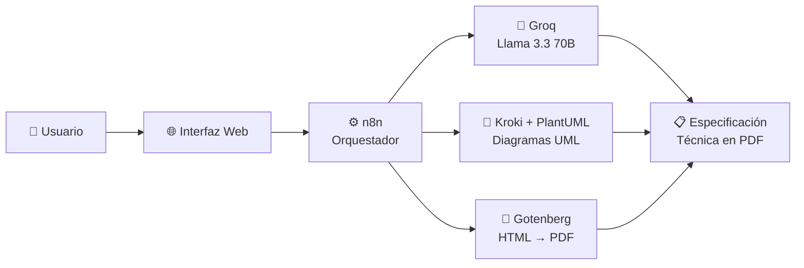
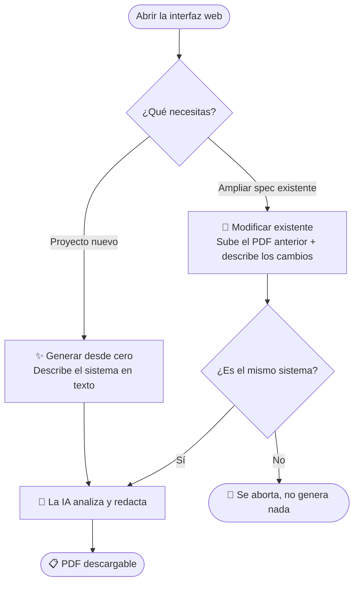

<div align="center">

# 📋 Generador de Especificaciones Técnicas con IA

**De una idea en lenguaje natural a un documento SRS completo, en menos de 2 minutos.**

[](https://www.docker.com/)
[](https://n8n.io/)
[](https://groq.com/)
[]()
[](./LICENSE)

</div>

---

> 📖 **Las instrucciones completas de instalación y uso están en [`MANUAL.pdf`](./MANUAL.pdf)** (también disponible en [`MANUAL.md`](./MANUAL.md)). Lo que sigue aquí es solo un resumen rápido para entender el proyecto y tenerlo funcionando en unos minutos.

## ✨ ¿Qué es esto?

Describe tu sistema en lenguaje natural —una entrevista con un cliente, unas notas sueltas, lo que sea— y en menos de dos minutos obtienes un **documento de especificación técnica (SRS) completo**: requisitos, casos de uso con diagramas UML, matriz de trazabilidad, estudios de viabilidad y mucho más, listo en PDF.

También puedes **ampliar una especificación ya existente**: sube el PDF anterior, describe los cambios, y el sistema detecta automáticamente si pertenecen al mismo proyecto antes de generar la versión ampliada.

Todo corre en tu propia máquina con Docker — nada de tus datos sale salvo el texto que envías a la IA para redactar el contenido.

## 🚀 Características principales

- 🧠 **Generación con IA** (Groq · Llama 3.3 70B) a partir de texto libre o archivo `.txt`
- 🔄 **Modo "ampliar existente"**: sube un PDF previo y detecta si es el mismo sistema antes de tocar nada
- 📐 **4 diagramas UML deterministas**: casos de uso (con `include`/`extend`), actividad, clases (con herencia y relaciones) y componentes
- 🔗 **Matriz de trazabilidad** requisitos ↔ casos de uso, con alertas si algo queda sin cubrir
- 📊 **Estudios de viabilidad** en 7 dimensiones (técnica, económica, legal, recursos, mercado, operacional, temporal)
- 🖥️ **Interfaz web** sencilla, sin necesidad de tocar n8n para usarlo día a día
- 🐳 **100 % self-hosted** vía Docker Compose, puertos configurables

## 🏗️ Arquitectura



## 🔄 Cómo funciona



## 📄 Qué incluye el documento generado

- Portada, resumen ejecutivo e introducción
- Requisitos funcionales, no funcionales y de información
- Análisis de calidad de los requisitos (basado en IEEE 830)
- Matriz de trazabilidad RF ↔ casos de uso, con alertas de cobertura
- Identificación de actores (con herencia) y casos de uso
- Diagramas UML: casos de uso, actividad, clases y componentes
- Glosario
- Estudios de viabilidad en 7 dimensiones
- Estudio de alternativas con recomendaciones y aprobaciones
- Análisis de riesgos

## ⚡ Instalación rápida

> Resumen exprés — para el detalle completo, ve a **[`MANUAL.pdf`](./MANUAL.pdf)**.

1. Ten **Docker Desktop** instalado y abierto, y consigue una clave gratuita en [console.groq.com/keys](https://console.groq.com/keys).
2. Clona el repo y copia `.env.example` como `.env`, rellenando tu `GROQ_API_KEY`.
3. ```
   docker compose up -d
   ```
4. Entra en `http://localhost:5678`, importa `spec-generator-workflow.json` y actívalo (toggle "Active").
5. Abre `http://localhost:8080` y genera tu primera especificación 🎉

> ⚠️ **Importante:** la imagen de n8n está fijada a la versión `1.118.1` a propósito. Las versiones `2.x` tienen un bug conocido que rompe los webhooks de producción — no la actualices a `latest`.

## 🧰 Stack tecnológico

| Componente | Tecnología | Función |
|---|---|---|
| Orquestador | n8n `1.118.1` | Coordina todo el flujo |
| IA generativa | Groq (Llama 3.3 70B) | Redacta y analiza los requisitos |
| Diagramas | Kroki + PlantUML | Renderiza UML de forma determinista |
| Generación de PDF | Gotenberg | Convierte HTML a PDF |
| Interfaz | nginx + HTML/CSS/JS | Web de usuario y proxy hacia n8n |
| Despliegue | Docker Compose | Todo en contenedores, self-hosted |

## 📁 Estructura del repositorio

```
├── compose.yaml                    # Stack completo (5 servicios)
├── .env.example                    # Plantilla de configuración (clave IA + puertos)
├── spec-generator-workflow.json    # Workflow a importar en n8n
├── MANUAL.pdf / MANUAL.md          # Manual completo de instalación y uso
├── ejemplos/                       # Textos de ejemplo para probar ambos modos
└── web/                            # Interfaz web (HTML/CSS/JS + config nginx)
```

## 📊 Límites a tener en cuenta

El plan gratuito de Groq da para unas **10-20 especificaciones al día** (límite de ~100.000 tokens/día). Si lo agotas, espera unos minutos o al día siguiente — se recupera solo.

## 👥 Equipo

| Autor | LinkedIn |
|---|---|
| **Francisco Joaquín Jiménez Cordero** | [Perfil](https://www.linkedin.com/in/francisco-joaquín-jiménez-cordero-931029417/) |
| **Álvaro Villalba Aranda** | [Perfil]([https://www.linkedin.com/in/TU-USUARIO-2/](https://www.linkedin.com/in/alvaro-villalba-aranda-b12314417/)) |

Desarrollado para el **Reto 1** de la **Hackathon Cátedra atmira OpenAI & Big Data**.

## 📄 Licencia

Este proyecto se distribuye bajo licencia [MIT](./LICENSE).
